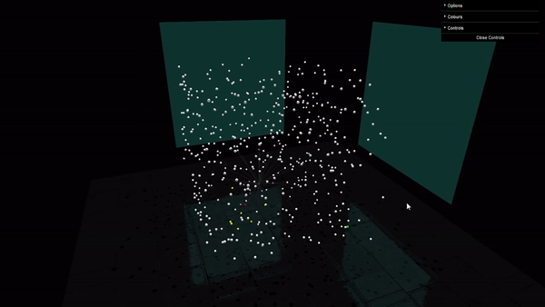

# Dijsktra's Algorithm

[Demo](https://dijkstra-threejs.netlify.app/)

A web animation to visualise dijsktra's algorithm in 3D. Generates an array of points in 3D and finds the shortest path between the starting node (red) and the ending node (green). Each line segment also has a maximum reach so the path isn't just a straight line from start to end. This simulates a graph as each point is connected to those within the maximum reach.

